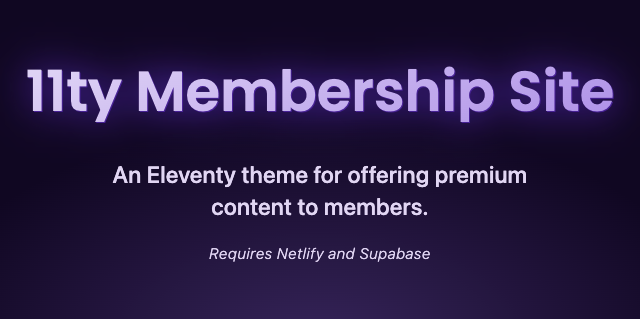
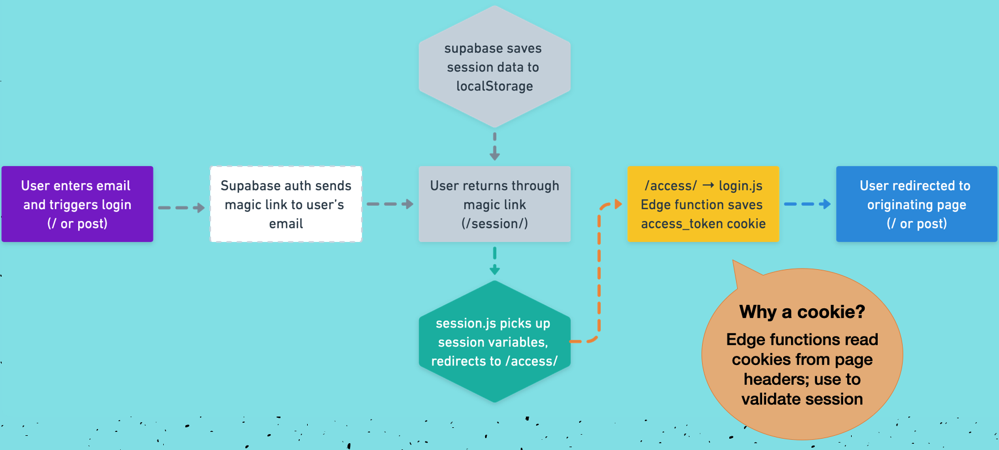
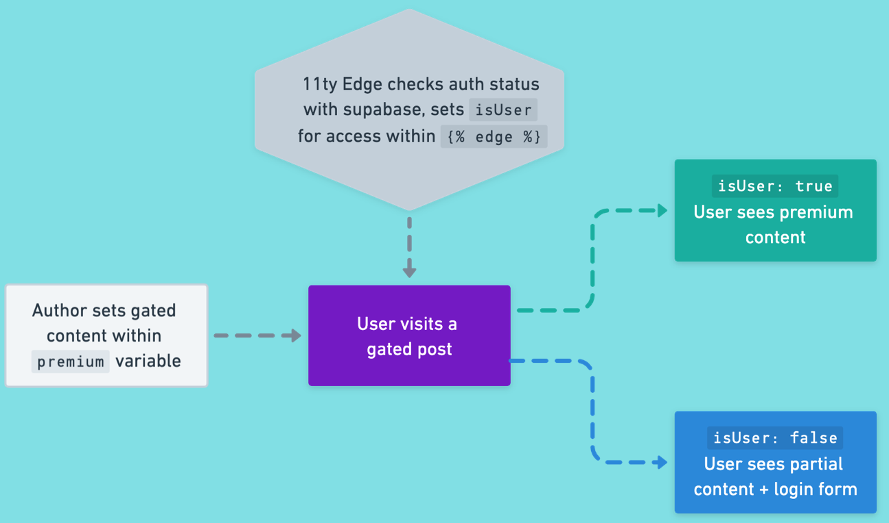

# 11ty Membership Site

> An Eleventy theme for offering premium content to members. Requires Supabase and Netlify accounts.

**[Review this post](https://11ty.rocks/posts/building-a-membership-site-with-11ty/) on the high-level concepts** of how this theme and the members-only content works.

## About this theme

- Authenticate users with Supabase Magic Links and provide members-only content
- Offer partial content previews to unauthenticated users
- Built using 11ty, Netlify Edge, and Supabase
- Uses no frameworks or bundlers, just vanilla JS (+ Deno on the Edge), Nunjucks, Markdown, and Sass
- Dark and light modes

## Prerequisites

- 11ty v2 beta+ (included)
- [Netlify account](https://netlify.com)
- [Netlify CLI](https://docs.netlify.com/cli/get-started/)
- [Supabase account](https://supabase.io)

## Setup

1. Update `src/_data/meta.js` with your site details.
2. Change the theme color by updating the `--primary-hue` value in `src/sass/_theme.scss`.
3. Replace `src/posts/post-preview.md` with your own content.
4. Complete the Supabase and Netlify steps described next.

### Supabase

1. Project settings > Auth

   - Ensure new user signups are enabled (default)
   - change JWT expiry to 604800

2. Authentication > URL Configuration

   - Change "Site URL" to your production (Netlify) URL
   - [Add wildcards for localhost and Netlify deploys](https://supabase.com/docs/guides/auth/overview#redirect-urls-and-wildcards) to support local and branch deploy development

3. Project settings > API

   - Prepare to copy the URL and public key

### Netlify

1. **Local terminal**:
   - Create new site: `ntl init`
   - Link to existing site: `ntl link`
2. **Netlify dashboard**: Site settings > Environment variables

   - Create `SUPABASE_KEY` and `SUPABASE_URL` to hold those values
   - _Alternatively_ [set environment variables via the CLI](https://www.netlify.com/blog/2021/07/12/managing-environment-variables-from-your-terminal-with-netlify-cli/)

## Development

Use the Netlify CLI for local development by running `ntl dev`. This allows running the Edge functions, and also will retrieve the environment variables from your site.

## Authentication Flow

1. User enters email and triggers magic link login from either the index or a post
2. Supabase auth sends a magic link to user's email
3. User returns through magic link and arrives at `/session/` where:
   - Supabase saves session data to localStorage
   - `session.js` picks up the session variables and redirects to `/access/`
4. `/access/` route loads the `netlify/edge-functions/login.js` Edge function which saves the `_access_token` cookie\*
5. User redirected to the login-originating page (either the index or a specific post)

> - **Why a cookie?** Edge functions can read cookies from page headers, so it's used to validate sessions across page loads.

## Members-Only Content Flow

1. The author determines which content (if any) will be gated by setting the `premium` variable
   - See `posts/post-preview.md` for an example
2. When a user visits a gated post, the 11ty Edge function (`netlify/edge-functions/eleventy-edge.js`) checks their authenticated status with Supabase, and sets `isUser` as global data for access within the `` shortcode
   - If `isUser: true` - user sees the premium content
   - If `isUser: false` - user sees partial content and the login form

## Opportunities for enhancements

- Create user dashboard
- Persist user profile data to Supabase
- Add in payment processing
- Use [WebC](https://11ty.rocks/posts/introduction-webc/) to save content bookmarks or perform other client-side interactions

## Resources

- Learn more about all kinds of 11ty topics on [11ty Rocks!](https://11ty.rocks)
- [Article about this using this theme](https://11ty.rocks/posts/building-a-membership-site-with-11ty/)
- [11ty Edge docs](https://www.11ty.dev/docs/plugins/edge/)
- [Supabase authentication docs](https://supabase.com/docs/guides/auth/overview)
- [Netlify Edge docs](https://docs.netlify.com/edge-functions/overview/)
